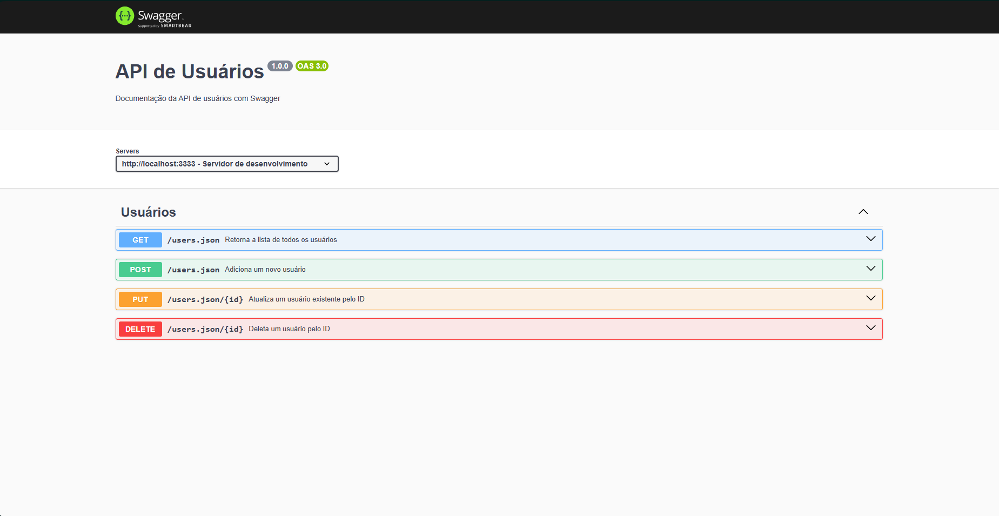

# API de usuários

## API para gerenciamento de usuários feito 100% em **Node.js**.
Persistência feita em arquivo `users.json` dentro da pasta `data/`

---

# Como usar?

1. Clone o repertório:

```bash
git clone https://github.com/Vinicius-Ricardo67/api-usuarios.git
cd api-usuarios
```

2. instale as dependências:

```bash
npm install
```

3. Inicie a API localmente:

```bash
npm run dev
```
A API estará disponível em **http://localhost:3333**

# Exemplos de uso com **curl**
**Criar um usuário**

```bash
curl -X POST http://localhost:3333/users \
    -H "Content-Type: application/json" \
    -d '{
    "nome": "João",
    "sobrenome": "Silva",
    "idade": 30,
    "profissao": "desenvolvedor",
    "cidade": "Pato Branco",
    "estado": "PR"
    }'
```

# Listar todos os usuários
```bash
curl http://localhost:3333/users
```

# Buscar usuário por ID
```bash
curl http://localhost:3333/users/{id}
```

# Atualizar usuário por ID
```bash
curl -X PUT http://localhost:3333/users/{id} \
    -H "Content-Type: application/json" \
    -d '{"profissao": "Dev Backend", "cidade": "Curitiba"}'
```

# Deletar usuário por ID
```bash
curl -X DELETE "http://localhost:3333/users/{id}"
```

---

## Referências da API

A API conta com uma documentação interativa gerada pelo **Swagger**:

[http://localhost:3333/api-docs](http://localhost:3333/api-docs)

---

## Estrutura do Usuário

Cada usuário cadastrado segue o seguinte modelo de dados:

- `id`: UUID único (gerado automaticamente)
- `nome`: texto, mínimo 3 caracteres
- `sobrenome`: texto, mínimo 3 caracteres
- `idade`: número inteiro (0 a 120)
- `profissao`: texto, mínimo 3 caracteres
- `cidade`: texto, mínimo 3 caracteres
- `estado`: sigla de 2 letras (SP, RJ, PR...)

---

## Resposta possíveis da API

- `200` -> Requisição bem-sucedida
- `201` -> Recurso criado
- `204` -> Sem conteúdo
- `400` -> Dados inválidos
- `404` -> Não encontrado

---

## Interface Swagger

A interface gráfica do Swagger facilita a exploração e teste das rotas.

